# AIBOOK 部署与使用OpenClaw

## 概述

OpenClaw  是一个由开源社区构建的个人 AI 助手框架，它将 LLM（大语言模型）与本地系统完全集成，创造了一个可以主动感知、记忆并行动的真正自主助手。与传统的聊天机器人不同，Moltbot 不仅仅是一个对话工具——它是一个 24/7 运行在你计算机或云服务器上的"代理"，拥有完整的系统访问权限，能够读写文件、执行命令、操控浏览器，并可以通过 QQ、飞书、钉钉 等多种国内聊天软件渠道与你沟通。


## 系统要求

| 要求 | 说明 |
| --- | --- |
| Node.js | \>=22 |
| 操作系统 | macOS/Linux/windows |
| 内存 | \>=4GB |
| 磁盘 | \>=2GB可用空间 |


## 监控与维护

```python
#查看日志
openclaw logs --follow

#检查系统健康
openclaw doctor

#更新到最新版本
openclaw update
```

## 实操（Ubuntu系统+Qwen模型为例）

### 打开终端并安装curl

```python
sudo apt install curl -y
```

### 安装 OpenClaw，详细安装步骤如下：

1.  打开终端键入如下命令：
    
    ```python
    curl -fsSL https://openclaw.ai/install.sh | bash
    ```
    
2.  根据提示进行配置，敲击Enter确认选项。下图是 OpenClaw 初始化配置（onboarding）过程中的**安全提示页面**，核心是告知你 OpenClaw 的权限风险并需要你确认是否继续，选择Yes。
    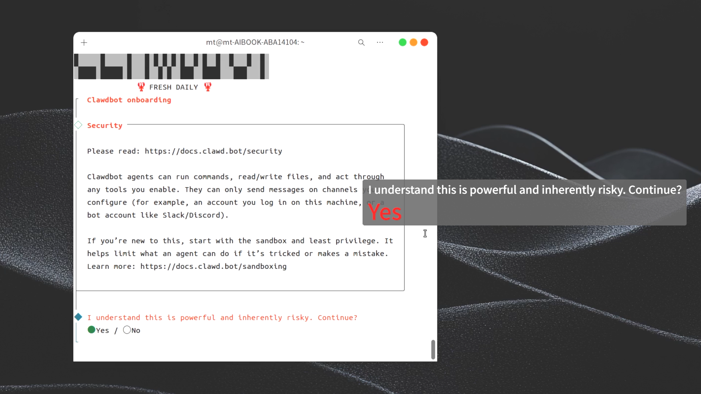
    
3.  这是 OpenClaw 初始配置（Onboarding mode）的模式选择界面，核心是让你选初始化的方式，选择快速启动
    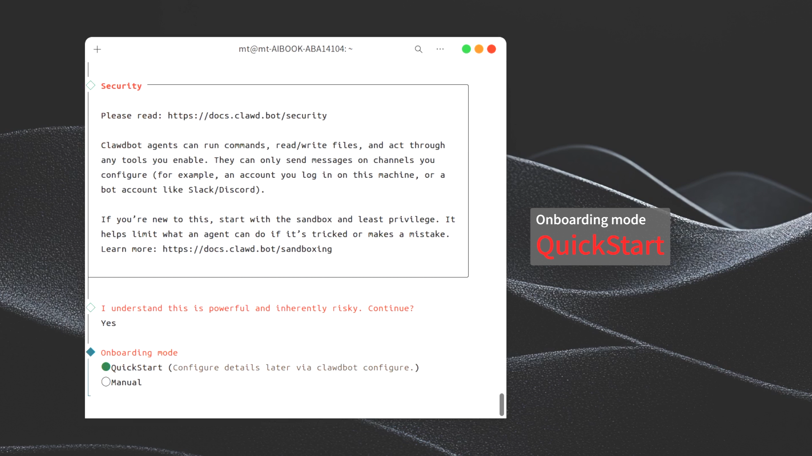
    
4.  这是 OpenClaw 配置流程中的**配置处理选项界面**，核心是让你选择如何处理已有的配置数据，选择使用现有配置。
    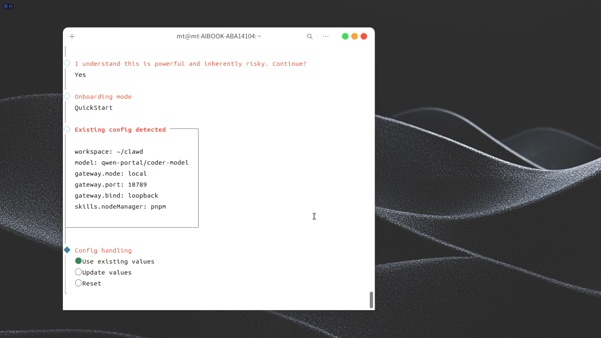
    
5.  这是模型选择界面，选择云端接入的模型，选择Qwen。
    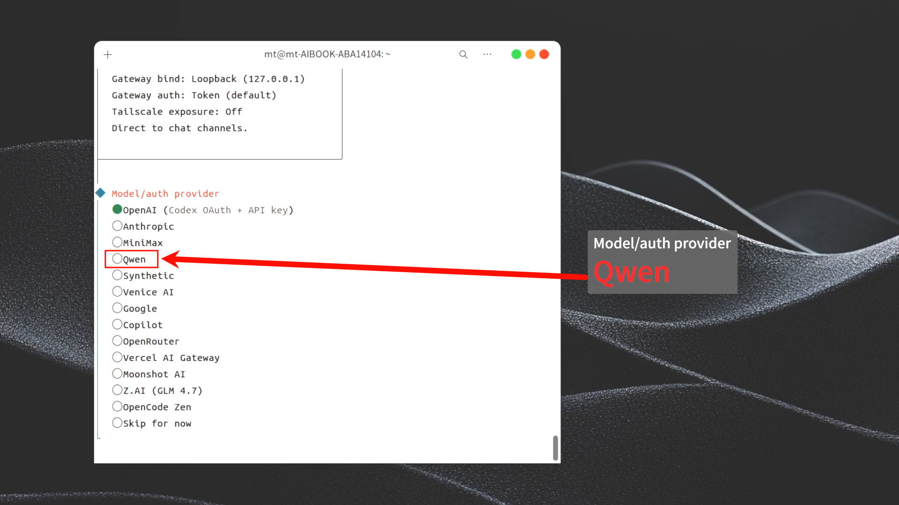
    
6.  这是通义千问认证方式，选择确认
    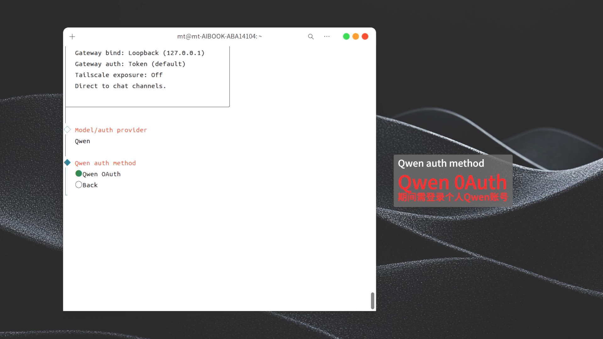
    
7.  登录Qwen账号并点击确认
    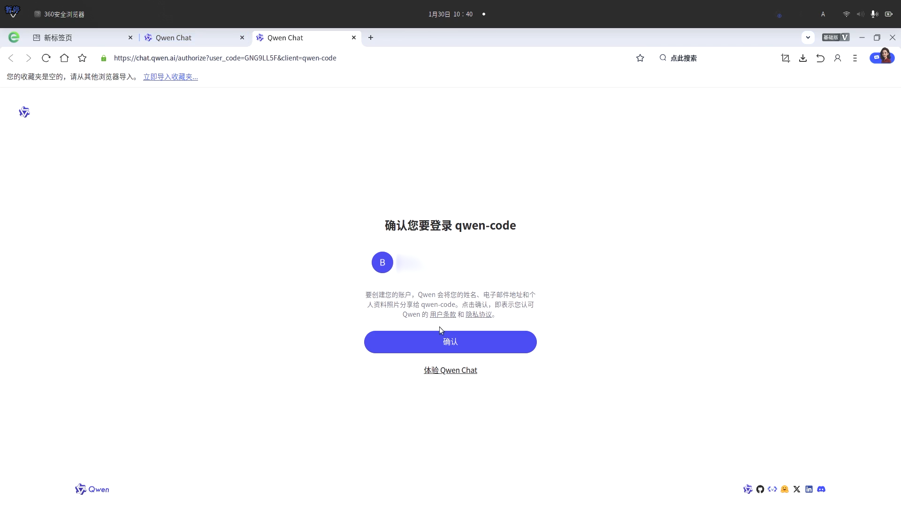
    
8.  这是 OpenClaw 配置中的**默认 AI 模型选择界面**，核心是选定 OpenClaw 默认使用的大模型，根据实际需求进行选择。
    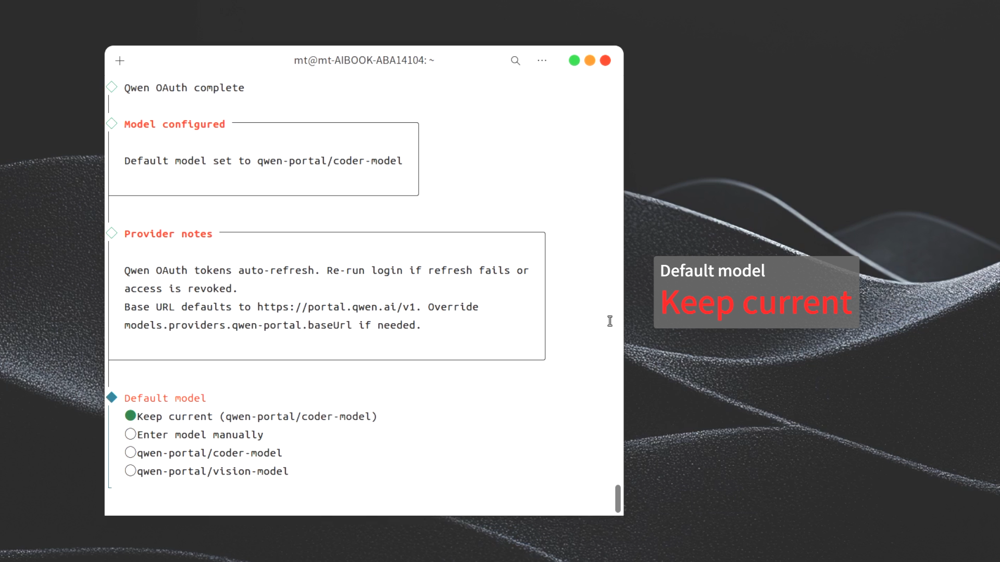
    
9.  这是 OpenClaw 快速启动（QuickStart）流程中的**聊天渠道选择界面**，核心是让你选择 OpenClaw 的交互渠道，根据实际需求进行选择。
    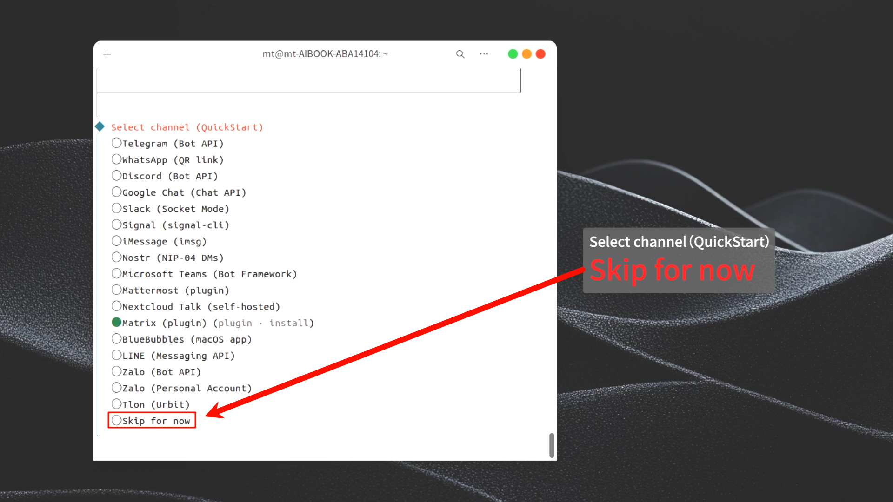
    
10.  这是 OpenClaw 配置流程中的**技能配置确认界面**选择Yes。
    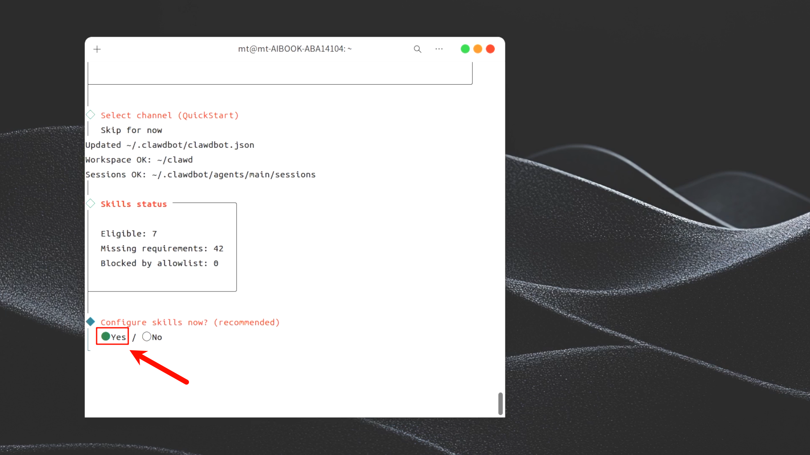
    
11.  这是 OpenClaw 配置流程中的**Hooks功能启用界面**，根据实际需求进行选择。
    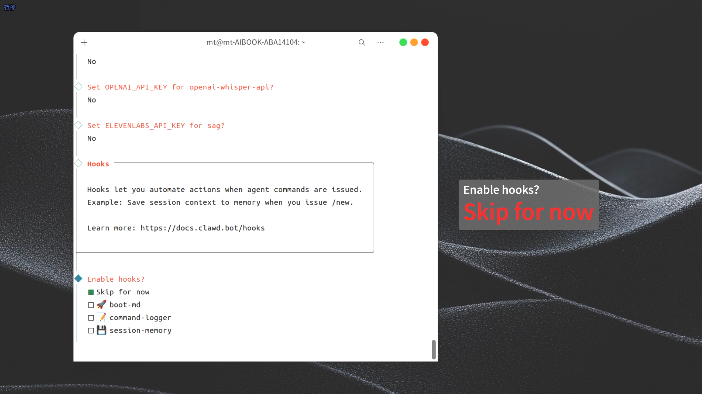
    
12.  这是 OpenClaw 配置流程中关于网关服务（Gateway service）的操作选择界面，选择重启。
    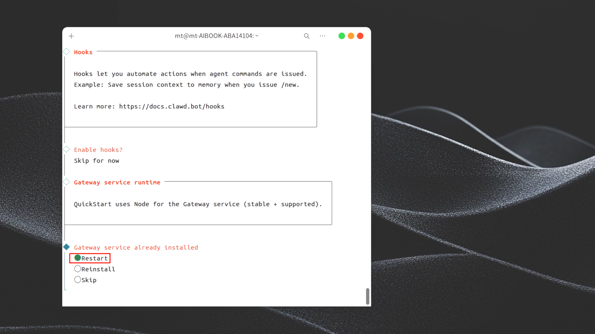
    
13.  这是 OpenClaw 初始化最后一步的**机器人启动方式选择界面**，根据用户需求进行选择。
    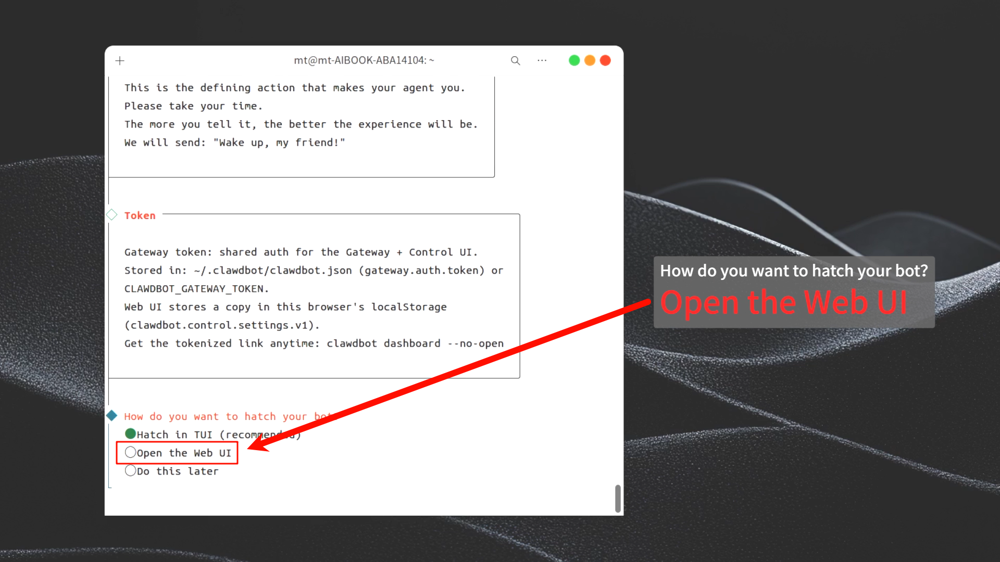
    
14.  选择完成后，弹出浏览器窗口，即可对话。
    
