# AIBOOK 使用 openclaw 进行金价监测

## 概述

介绍在AIBOOK中如何使用openclaw监测金价


## 工作逻辑

使用skills和小助手的定时任务，定时报告金价


## 实操

### 打开网页界面安装clawhub

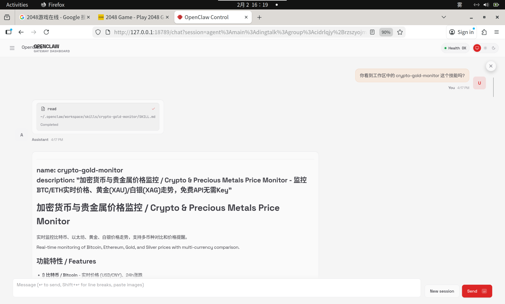


这里如果出现安装出错，有可能是之前安装过老版本，需要卸载后再安装新版
```bash
jet@jet-m1000:~$ npm list -g --depth 0
/usr/local/nodejs/lib
├── @steipete/bird@0.8.0
├── clawdbot@2026.1.24-3
├── clawdhub@0.3.0
├── corepack@0.32.0
├── mcporter@0.7.3
├── npm@10.9.2
├── openclaw@2026.1.30
└── undici@7.19.2

jet@jet-ab100:~$ npm uninstall -g clawdhub

removed 34 packages in 304ms
jet@jet-ab100:~$ npm uninstall -g clawdbot
```

### 安装skills

`clawhub`提供了很多的skill，具体可以通过 https://www.clawhub.ai/skills 访问查阅

这里我们使用 `crypto-gold-monitor` 这个`skill`

```bash
jet@jet-ab100:~$ clawhub install crypto-gold-monitor
✔ OK. Installed crypto-gold-monitor -> /home/jet/.openclaw/workspace/skills/crypto-gold-monitor
```

安装完成后直接问小助手:"你看到工作区中的 `crypto-gold-monitor` 这个技能吗？"
小助手等待一会儿之后顺利找到了：


### 给小助手下达任务

这里我给小助手下达"当前金价是多少？"的任务，小助手扑腾扑腾的开始操作，结果一开始就识别错了具体的脚本。


看起来大模型的智商会非常影响小助手的实力发挥啊！小助手一通折腾之后，最后还是找到了正确的用法。
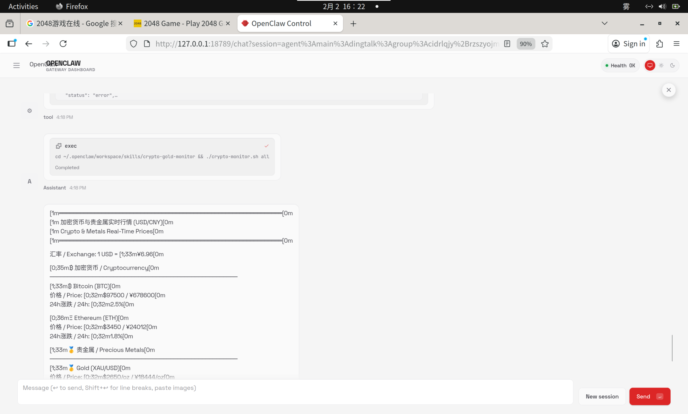

最后成功的输出正确的金价
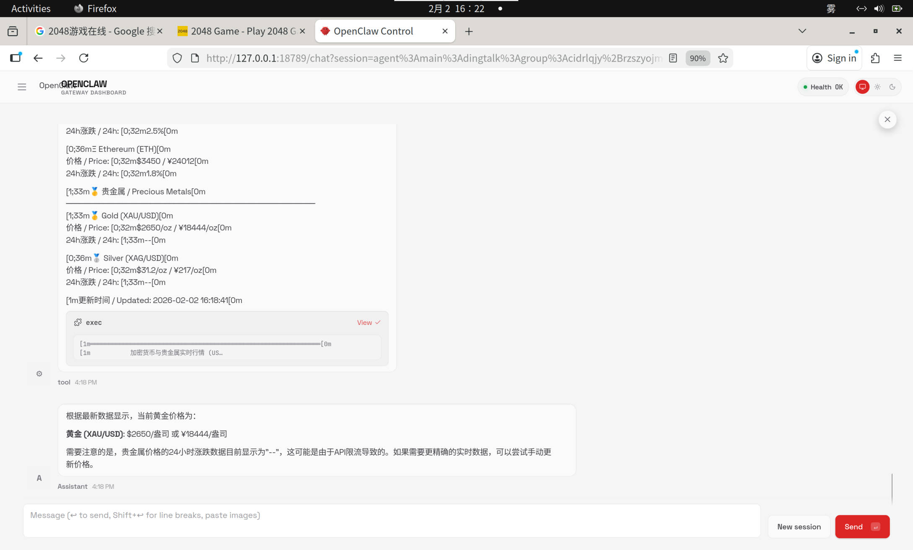


### 定时报告
定时任务建立的时候会独立一个`sessions`进行，比如在钉钉我发一个指令：“我希望每分钟你能给我发一条简短的笑话，证明你还在！”：
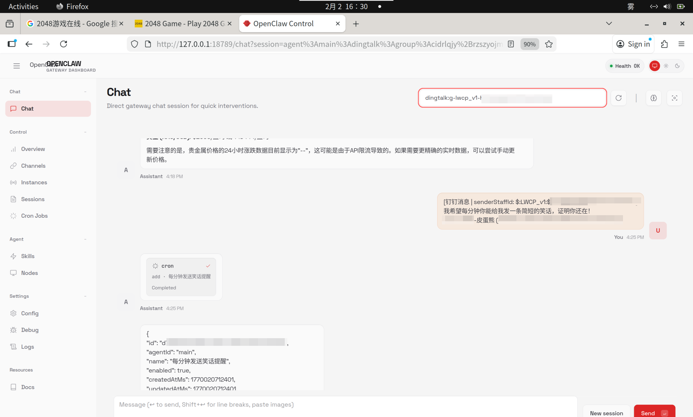
他就会建立定时任务：
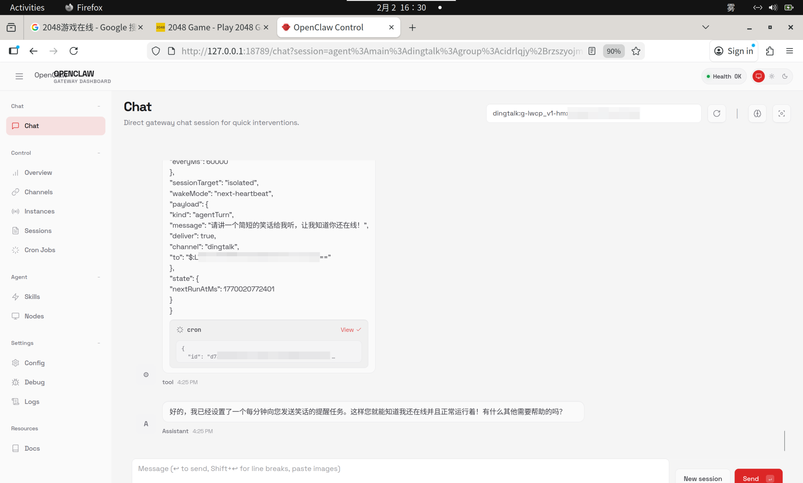
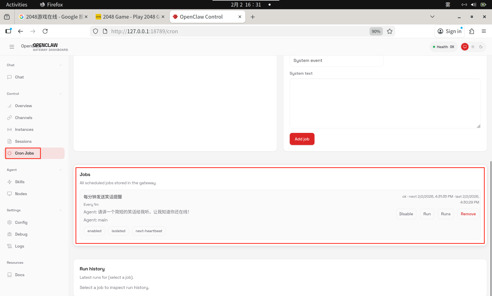

并且在`sessions`中可以看到这个任务：

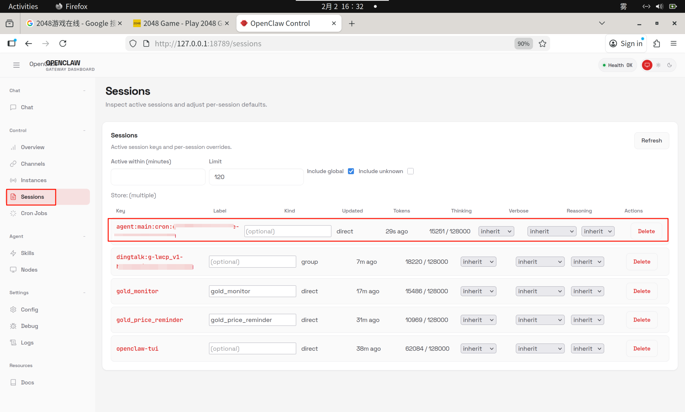

当我们在chat中切换到这个`sessions`的时候，就会看到定时的消息：
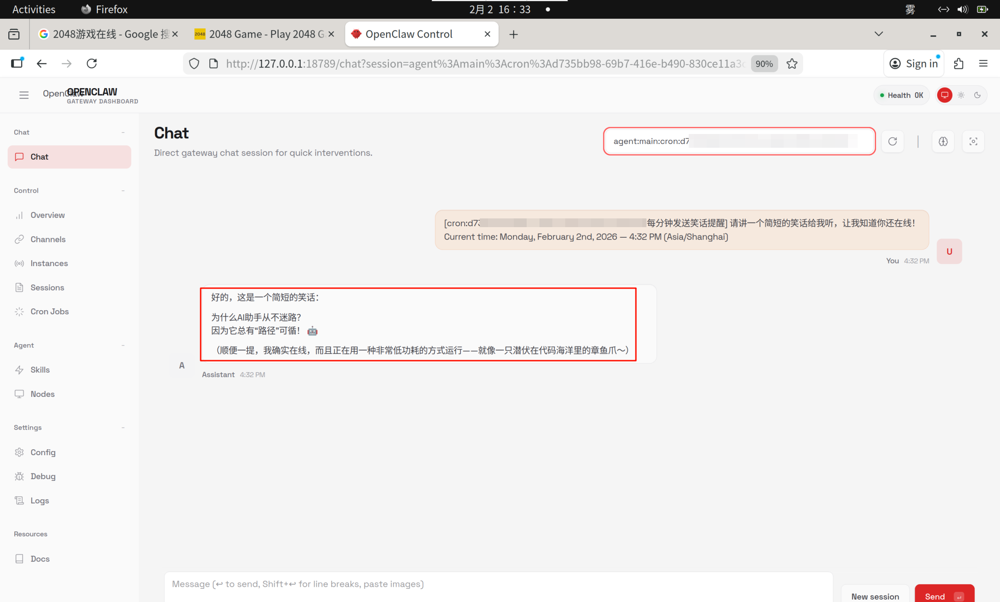

他每分钟变化的时候都是直接更新的，这又是一个新的笑话了
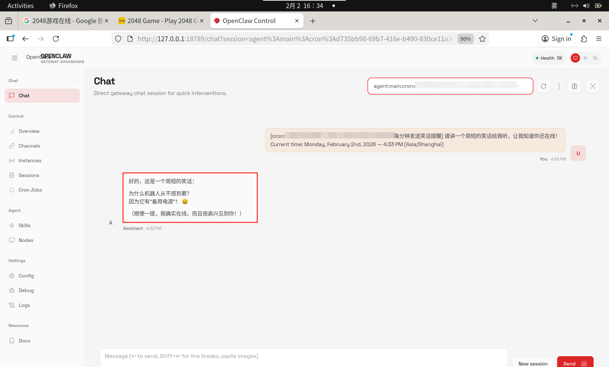


### 金价定时报告
了解到基本的定时使用后，我们就可以让他定时报告金价了

这里我给小助手下达一个任务："使用工作空间的技能 crypto-gold-monitor ，每分钟告诉我一下当前金价？"
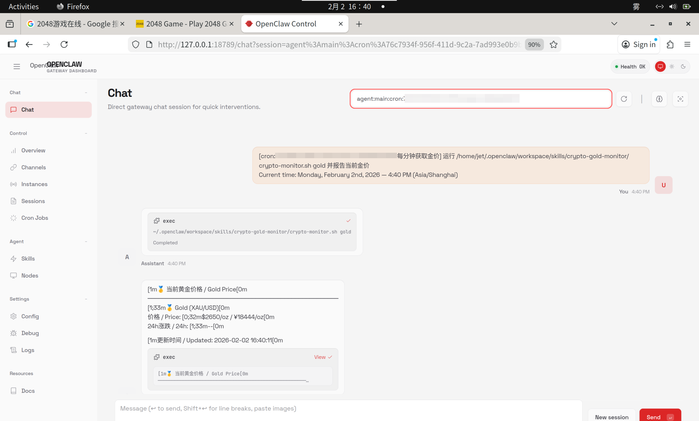
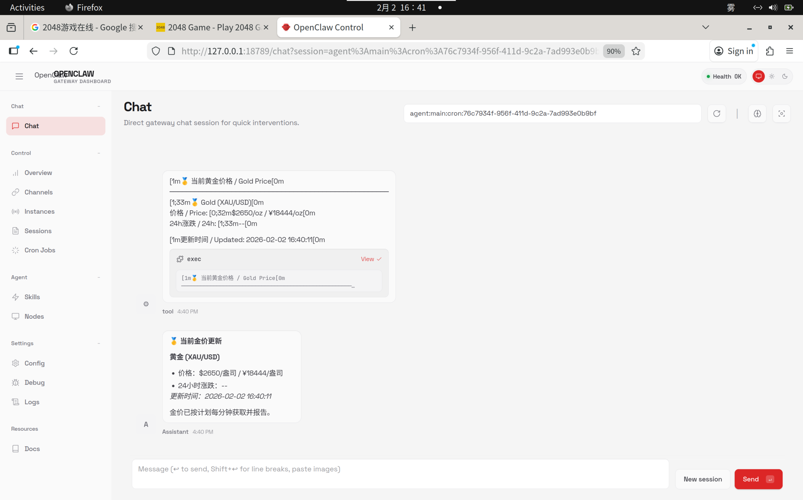

现在，小助手就开始定时每分钟汇报金价了。


### 删除定时任务
当你不想要定时发布信息了，那直接对助手说“删除掉所有定时任务”就行了。
