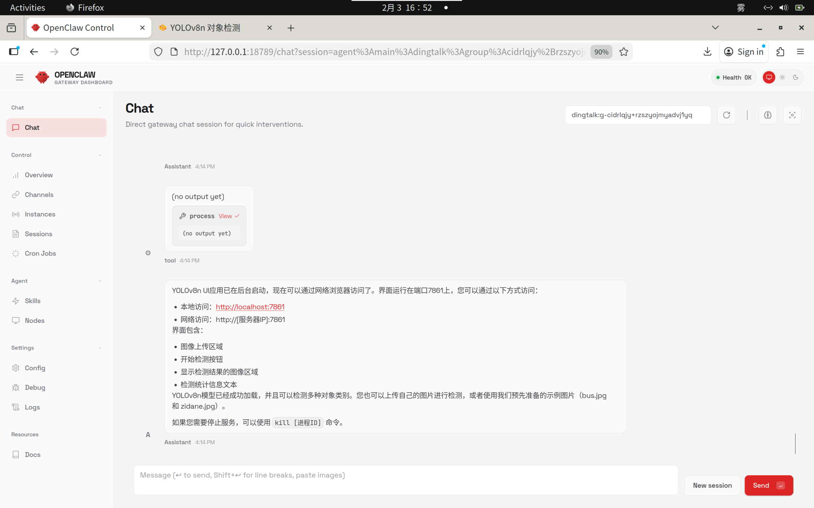
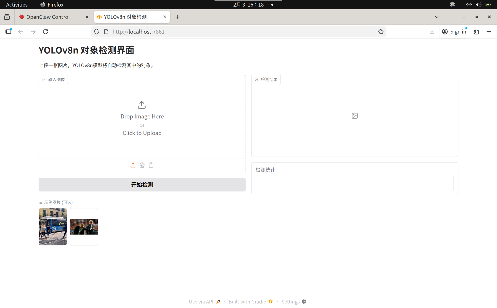
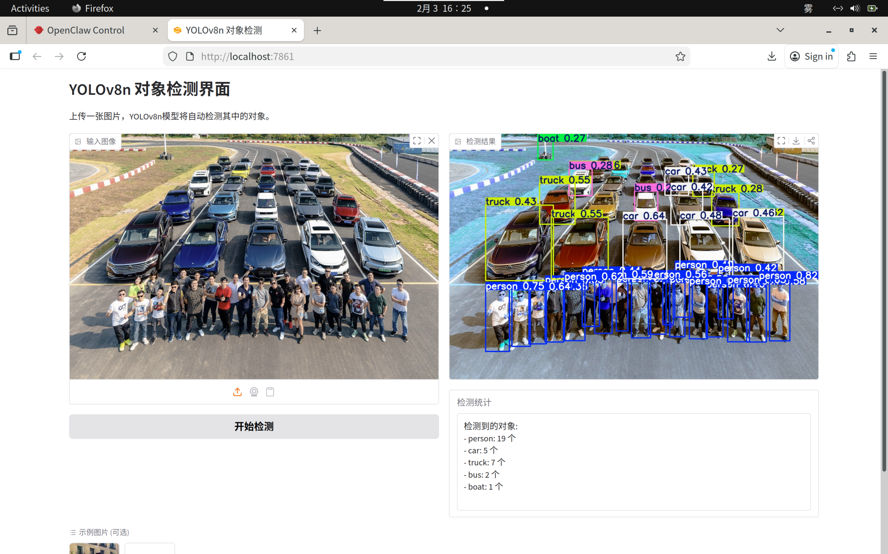
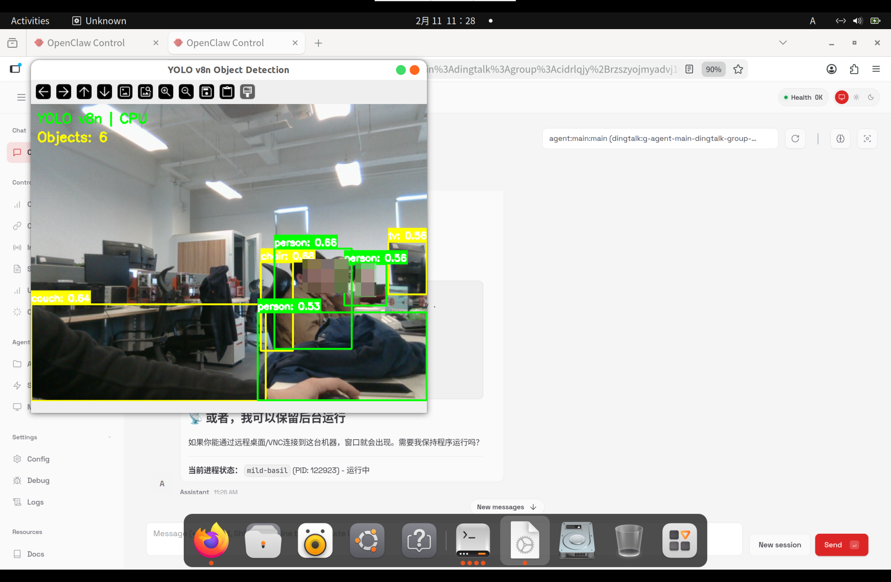

# AIBOOK 5分钟，3句话，让OPENCLAW 完成 YOLOv8n 目标检测demo

## 概述

介绍在AIBOOK中如何使用openclaw，在几轮对话中，完成快速部署YOLOv8n 并开发UI界面进行推理


## 工作逻辑

1. 让openclaw了解当前运行环境，
2. 让openclaw开始完成部署和开发任务


## 实操

### 第一轮对话（让AI了解现在运行的平台）

**我的提问**：`"帮我检查一下GPU的驱动，是摩尔线程的GPU。"`

**助手回复**：

---
> 现在我有了关于摩尔线程GPU的完整信息。以下是更新后的系统环境总结，特别是GPU部分：
> ### GPU 环境详情
> #### 摩尔线程 GPU 信息
> - GPU 型号: M1000
> - 驱动状态: 已正确安装并配置
> - 显存: 总共 31.15 GB，当前可用 18.12 GB (58% 使用率)
> - 计算单元: 8个流式多处理器 (multiProcessorCount)
> - 架构: MUSA 架构 (摩尔线程自家的GPU计算平台)
> - PCI 信息: 总线 ID 为 0x0，设备 ID 为 0x0
> - 内存总线宽度: 256位
> - 集成显卡: 是 (isIntegrated: 1)
> #### 软件栈
> - MUSA 驱动: 版本 3.1.0-AB100
> - MUSA SDK: 版本 4.1.2
> - 工具链: 已安装完整的 MUSA 开发工具链
> - 编程接口: 支持 MCC (MUSA C Compiler) 编译器
> #### 性能特征
> - 每个多处理器最大线程数: 6144
> - 每块最大线程数: 1024
> - warp size: 128 (这与传统CUDA的32有所不同)
> - 全局内存: 31.15 GB，适合大规模数据处理
>
> 这是一个相当强大的国产GPU解决方案，特别适合AI计算和高性能计算任务。摩尔线程的MUSA架构提供了类似CUDA的功能，可以用于深度学习、科学计算等任务。
> 非常感谢您提供的信息，这让我们对系统有了更全面的了解。摩尔线程GPU的集成使得这个系统非常适合AI模型训练和推理工作。

---

### 第二轮对话（让AI提炼信息）

**我的提问**：`"基于你对我电脑硬件、软件、CPU、GPU、NPU等组件的了解，总结一个文档，叫《Xiong's M1000 Summary》"`

**助手回复**：

---
> # Xiong's M1000 Summary
> ## System Overview
> This document provides a comprehensive summary of the M1000 system configuration, including hardware specifications, software environment, and computing capabilities.
> ## Hardware Configuration
> ### CPU
> - Architecture: ARM64 (aarch64)
> - Processor: 12-core ARM Cortex-A78
> - Threads: 12 cores, 1 thread per core (12 total threads)
> - Cache:
>     - L1d Cache: 768 KiB (12 instances)
>     - L1i Cache: 768 KiB (12 instances)
>     - L2 Cache: 6 MiB (12 instances)
>     - L3 Cache: 12 MiB (3 instances)
>     - BogoMIPS: 50.00
> ### Memory
> - RAM: 32 GiB DDR4/LPDDR4/LPDDR5 (depending on platform)
> - Available: ~26 GiB free (as of check)
> - Swap: 8.0 GiB
> ### Storage
> - Root Partition (/): 98 GB total, 77 GB used (83%), 17 GB free
> - Home Partition (/home/skysi): 369 GB NVMe SSD, 84 GB used (24%), 267 GB free
> - Other Partitions: Various tmpfs partitions for system operations
> ### GPU
> - Model: Moore Threads M1000
> - Architecture: MUSA (Moore Threads Unified System Architecture)
> - VRAM: 31.15 GB GDDR6, with 18.12 GB currently free (58% usage)
> - Compute Units: 8 Streaming Multiprocessors
> - Max Threads: 6144 per multiprocessor, 1024 per block
> - Warp Size: 128 (different from CUDA's 32)
> - Memory Bus Width: 256-bit
> - Integrated: Yes (isIntegrated: 1)
> ### Other Components
> - Network Controller: Realtek Semiconductor (rev ff)
> - USB Controller: Renesas Technology uPD720201 USB 3.0
> - NVMe Controller: Shenzhen Shichuangyi Electronics MAP1202-based SSD
> ## Software Environment
> ### Operating System
> - Distribution: Ubuntu 22.04.4 LTS (Jammy Jellyfish)
> - Kernel Version: 6.6.10
> - Architecture: ARM64
> - System Type: SMP PREEMPT (Symmetric Multiprocessing)
> ### GPU Software Stack
> - Driver: Moore Threads MUSA driver version 3.1.0-AB100
> - SDK: Moore Threads MTGPU Software Development Kit version 4.1.2
> - Installation Path: /usr/local/musa -> /usr/local/musa-4.1.2
> - Tools: Complete MUSA development toolchain installed
> ### Runtime Environment
> - OpenClaw: Running as gateway process (PID 26409)
> - Node.js: Available via npm global installation (~/.npm-global)
> - Package Manager: APT for system packages
> ## Computing Capabilities
> ### AI/ML Performance
> - The combination of powerful ARM CPU cores and Moore Threads M1000 GPU makes this system suitable for:
>     - Deep learning training and inference
>     - Large-scale data processing
>     - Parallel computing tasks
>     - AI model development and testing
> ### Development Support
> - Full MUSA development environment for GPU programming
> - Standard Linux development tools
> - Node.js runtime for application development
> - OpenClaw AI framework for autonomous operations
> ### System Status
> - Running Processes: OpenClaw gateway active
> - Storage: Root partition approaching capacity (83% used), consider cleanup
> - Memory: Adequate free memory available
> - GPU: Ready and available for compute tasks
> ## Notes
> - The system appears to be a custom-built high-performance computing platform designed for AI and machine learning workloads
> - The integration of ARM CPU with Moore Threads GPU represents a domestically developed computing solution
> - The NVMe storage provides fast I/O for data-intensive applications
> 文档已保存至 /home/user/.openclaw/workspace/Xiong's M1000 Summary.md


---


### 第三轮对话（让AI部署并开发UI）

**我的提问**：`"好，帮我在我的电脑上部署YOLO v8n 这个模型，并开发一个UI界面让我可以使用YOLO v8n 进行推理"`

**助手最终回复**：

---
> YOLOv8n UI应用已在后台启动，现在可以通过网络浏览器访问了。界面运行在端口7861上，您可以通过以下方式访问：
>
>    本地访问：http://localhost:7861
>    网络访问：http://[服务器IP]:7861
>
> 界面包含：
>
>    图像上传区域
>    开始检测按钮
>    显示检测结果的图像区域
>    检测统计信息文本
>
>YOLOv8n模型已经成功加载，并且可以检测多种对象类别。您也可以上传自己的图片进行检测，或者使用我们预先准备的示例图片（bus.jpg 和 zidane.jpg）。
>
>如果您需要停止服务，可以使用 kill [进程ID] 命令。

---

### 检测成果

访问地址：http://localhost:7861







默认模型下人识别的不错，车识别率不太高，不过最基本的5分钟快速运行已经做到了。

### 第四轮对话（让AI调用摄像头）
**我的提问**：`"帮我在我的电脑上部署YOLO v8n 这个模型，并开发一个UI界面让我可以使用YOLO v8n 进行推理，我需要调用本地机器上的摄像头进行实时识别"`

**助手回复**：

---
> ✅ YOLO v8n 实时目标检测已部署完成！
> ## 📁 创建的文件
>
>| 文件 | 说明 |
>| --- | --- |
>|yolo_realtime.py | 主程序 - 实时目标检测UI |
>|YOLO_README.md   | 使用说明文档 |
>|yolov8n.pt | YOLOv8 Nano 模型 (6.2 MB) |
>## 🚀 启动方式
```bash
cd /home/jet/.openclaw/workspace
python3 yolo_realtime.py
```
> ##🎮 操作说明
>•  空格键 - 暂停/继续
>•  S - 截图保存
>•  Q / ESC - 退出

> ⚠ 注意事项
> 当前使用 CPU 推理（MUSA 不可用），预计 5-10 FPS。
> 待摩尔线程 GPU 驱动环境安装MUSA推理库后，可大幅提升性能。
> 需要我帮你运行测试一下吗？
---

**继续对话**：`"好的，帮我运行一下吧"`

**助手回复**：
---
>✅ 程序已成功启动！
>
>运行状态：
>- ✅ YOLO v8n 模型已加载
>- ✅ 摄像头已启动 (640×480 @ 30fps)
>- ✅ 推理引擎运行中

---
这时候就是实时更新的了。

