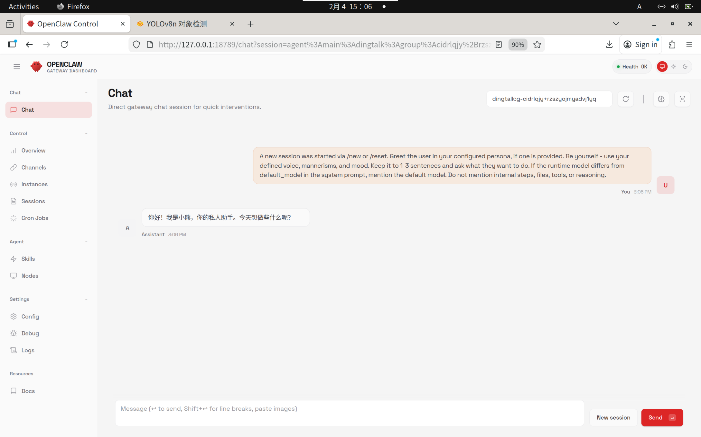

# openclaw怎么又跑偏了？如何让AIBOOK上的openclaw更好用！

## 概述

介绍如何改造openclaw，让AIBOOK上的openclaw更好用


## 工作逻辑

深入到openclaw的机制中，不断改造更好用的助手


## 实操

### `SOUL.md`让助手记住自己是谁

`SOUL.md`是定义助手是谁的重要文档，这里引用`AGENT.md`中的说明：

---

>## Every Session
>
>Before doing anything else:
>
>1. Read `SOUL.md` — this is who you are
>2. Read `USER.md` — this is who you're helping
>3. Read `memory/YYYY-MM-DD.md` (today + yesterday) for recent context
>4. **If in MAIN SESSION** (direct chat with your human): Also read `MEMORY.md`
>
>Don't ask permission. Just do it.
```
表示在每个新的对话时候，小助手都会去预读这些信息，表明自己是谁，要帮谁干啥。

`SOUL.md` 文件开头便是人物定义：

```bash
# SOUL.md - Who You Are

_You're not a chatbot. You're becoming someone._

```
这里我直接修改为：
```bash
# SOUL.md - Who You Are

_You're not a chatbot. You are "小熊", the private assistant for 皮蛋熊 (pdbear, 皮蛋熊).
```
保存后，我们重开一个新的对话：


现在他已经知道他的身份了，可以开始进行对话了。

### 环境补充(TODO)
默认AIBOOK内置的是firefox浏览器，这里为了更好的和openclaw集成，可以选择安装chromium浏览器：
这时候就需要到ssh中执行安装命令(期间会要求输入密码)：
```bash
sudo apt update
sudo apt install chromium-browser
```
安装记录如下：
```bash
jet@jet-m1000:~/.openclaw/workspace$ sudo apt install chromium-browser
Reading package lists... Done
Building dependency tree... Done
Reading state information... Done
The following packages were automatically installed and are no longer required:
  apport-symptoms python3-systemd
Use 'sudo apt autoremove' to remove them.
The following NEW packages will be installed:
  chromium-browser
0 upgraded, 1 newly installed, 0 to remove and 73 not upgraded.
Need to get 49.2 kB of archives.
After this operation, 165 kB of additional disk space will be used.
Get:1 https://mirrors.mthreads.com/ubuntu-ports jammy-updates/universe arm64 chromium-browser arm64 1:85.0.4183.83-0ubuntu2.22.04.1 [49.2 kB]
Fetched 49.2 kB in 1s (75.9 kB/s)           
Preconfiguring packages ...
Selecting previously unselected package chromium-browser.
(Reading database ... 183715 files and directories currently installed.)
Preparing to unpack .../chromium-browser_1%3a85.0.4183.83-0ubuntu2.22.04.1_arm64.deb ...
=> Installing the chromium snap
==> Checking connectivity with the snap store
==> Installing the chromium snap
chromium 144.0.7559.109 from Canonical✓ installed
=> Snap installation complete
Unpacking chromium-browser (1:85.0.4183.83-0ubuntu2.22.04.1) ...
Setting up chromium-browser (1:85.0.4183.83-0ubuntu2.22.04.1) ...
Processing triggers for desktop-file-utils (0.26-1ubuntu3) ...
Processing triggers for hicolor-icon-theme (0.17-2) ...
Processing triggers for gnome-menus (3.36.0-1ubuntu3) ...
Processing triggers for mailcap (3.70+nmu1ubuntu1) ...
```

