# 什么！一句话提交PR？看AIBOOK如何用openclaw助力编码工作

## 概述

介绍如何在AIBOOK上使用openclaw，提高工作效率


## 工作逻辑

`openclaw`是一个非常有力的工作助手（**前提是后端大模型足够聪明，本地小模型可能无法胜任**），现在他运行在AIBOOK上，
可以协助我们完成很多工作上的任务。

### 前置情景

我是一个`开发者`，现在出差途中，正在准备登机！**来不及打开电脑了**。

突然有一个紧急小需求，代码不复杂，可以几句话描述清楚，但时间非常紧迫，需要在下飞机前完成。

以往这时候我们就要去麻烦同事帮忙完成这个需求了，但现在有了openclaw，我们只需要告诉小助手，就可以完成这个需求了。

看看这个任务怎么能在1~2句话就完成。


## 实操

### 安装github技能
作为一个开发者，我们希望小助手能帮我们完成github任务，这里就需要安装github技能。

只需要在网页端点击`Skills`页面，然后搜索`github`，展开就可以看到`BUILD-IN SKILLS`中的`github`技能
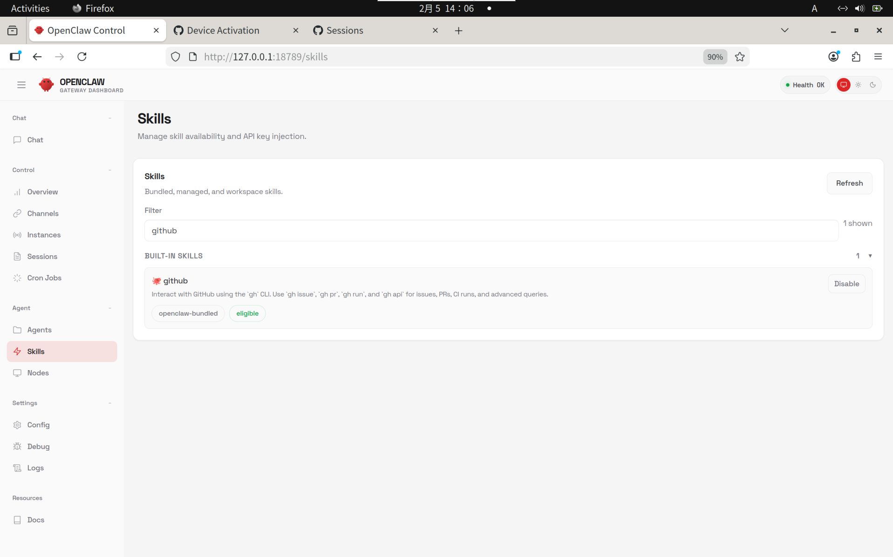

这里我已经安装过了，如果没有安装过的小伙伴，这里应该会有安装按钮：
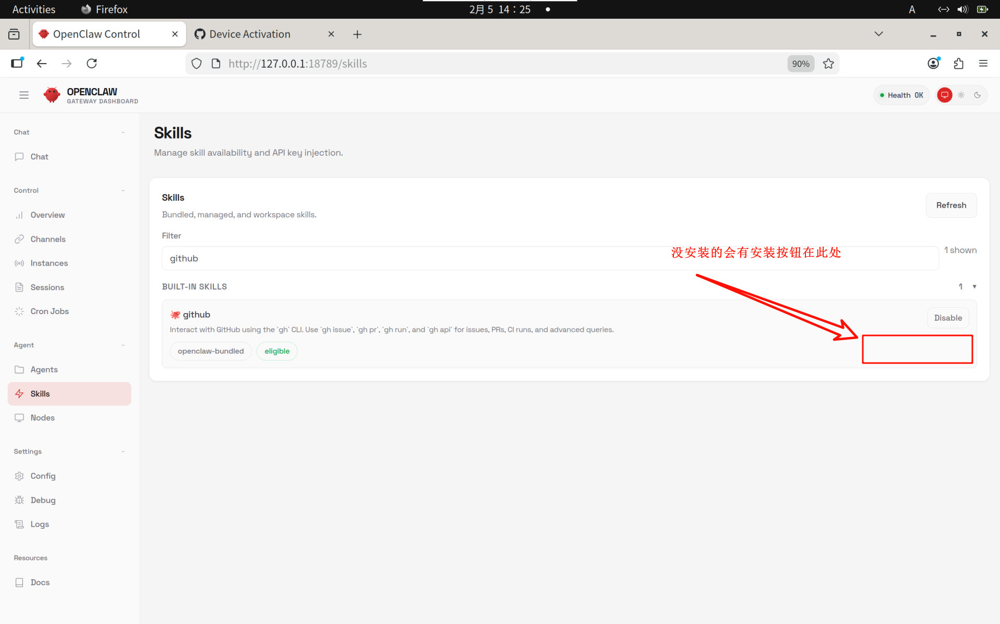


### 配置github账号

技能已经安装完毕了，这里我们需要先去配置下github账号，如果没有账号的小伙伴可以考虑用自己的邮箱注册一个账号。

**注意**：**我们需要先确保默认浏览器中已经登录了Github的账号**

在登录了`github`账号之后这里我们在`bash`窗口输入如下命令：
```bash
gh auth login
```
输入命令后，这里会挨个让你选择，我是这样子选择：

```bash
jet@jet-ab100:~$ gh auth login
? Where do you use GitHub? ----> GitHub.com
? What is your preferred protocol for Git operations on this host? ----> HTTPS
? Authenticate Git with your GitHub credentials? ----> Yes
? How would you like to authenticate GitHub CLI? ----> Login with a web browser

! First copy your one-time code: D189-E744
Press Enter to open https://github.com/login/device in your browser...
```
可以看到当我最后选择了通过浏览器进行登录的时候，下方弹出了一个一次性的验证码`D189-E744`
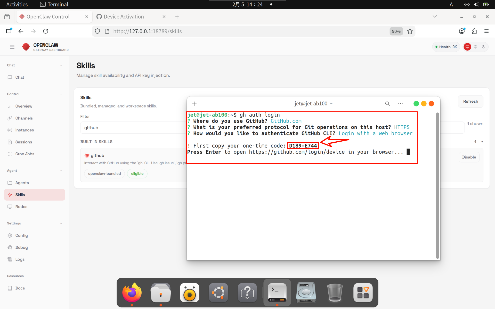

这时候我们敲回车，网页即可打开：
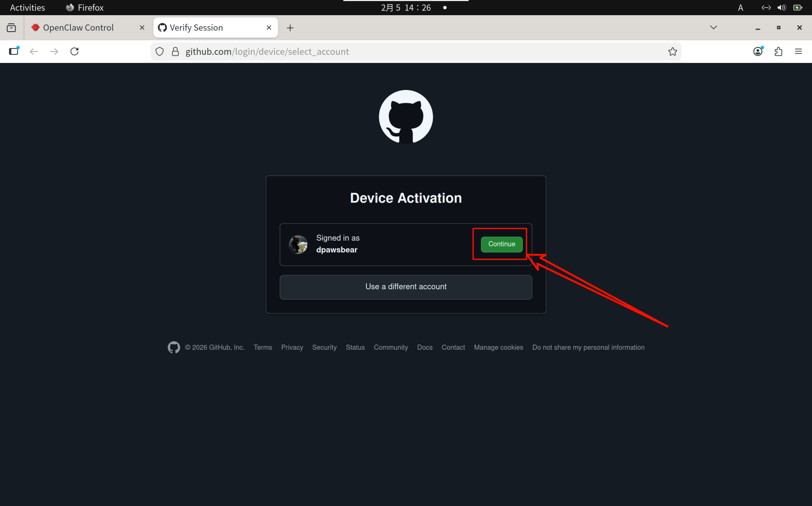

这时候我们点击`continue`，就需要输入配对码了

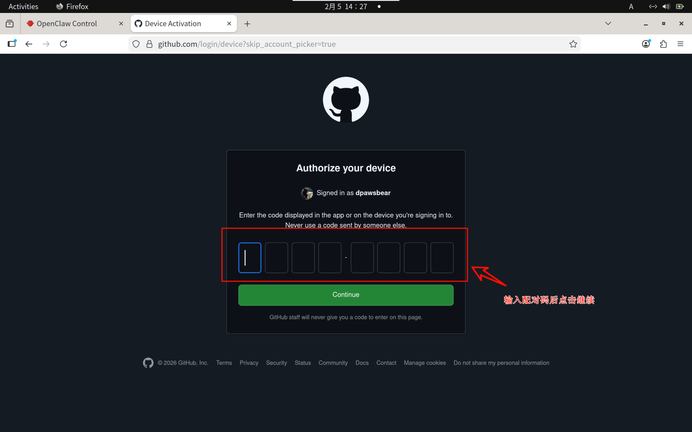

我们需要在弹出的网页中输入这个配对码，也就是上面窗口发送的验证码，这里我的是`D189-E744`，不同电脑当然是不一样的啦，
请根据`bash`窗口的提示输入正确验证码，不要输入我这个哈。

最后点击`Authorize github`：
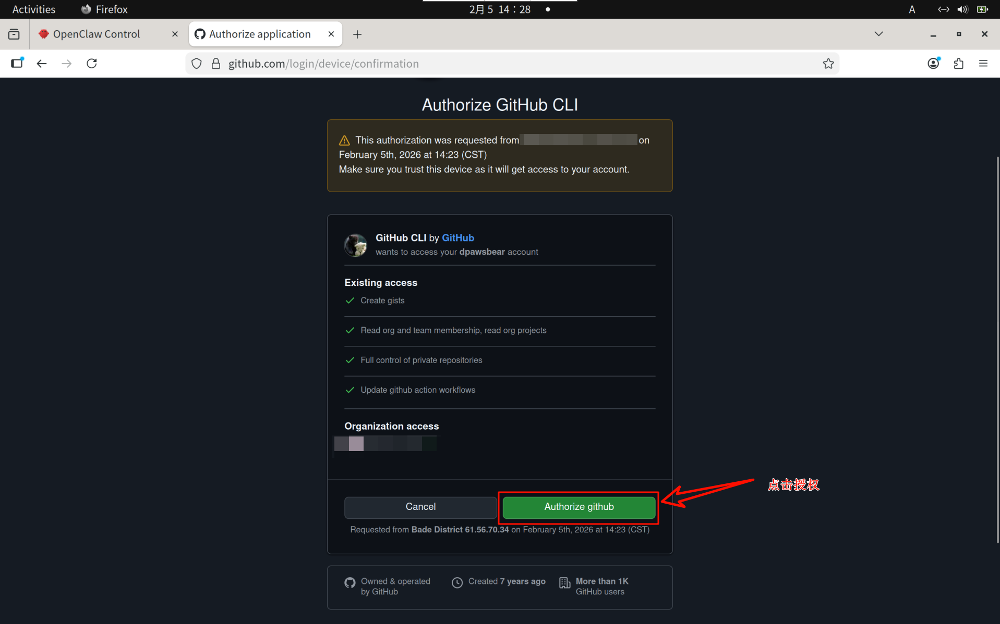

如果你的账号设置的安全比较完善，这里还会有动态验证码的环节
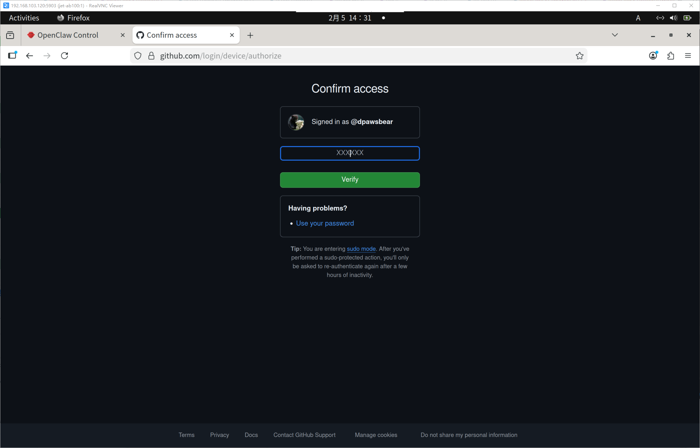

输入正确的动态验证码之后，会提示你连接成功，恭喜你啊！
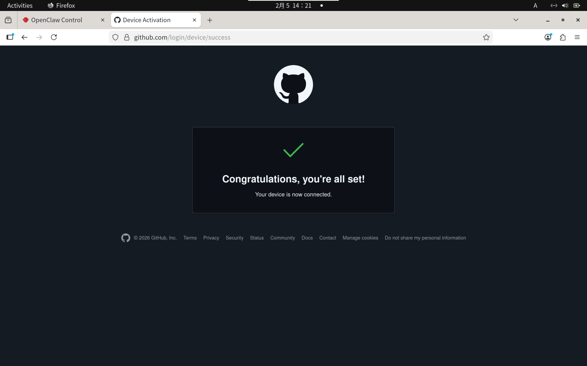


### 正式开始
之前铺垫了那么多的准备工作，现在终于进入到了正式的任务执行环节了。

#### 需求描述

---

麻烦你帮忙给 https://github.com/pdbear/openclaw-M1000-playground 这个仓库提交一个PR，
描述如下：
- 在仓库的根目录下的utils目录中添加一个文件`TechDoc.md`（没有这个目录就创建一个utils目录）。
- `TechDoc.md`文件记录摩尔线程开发文档地址内容，能以表格形式展示，表格包含文档标题、文档简介、具体链接地址三项，要求排版美观、大方。
- 摩尔线程文档中心链接地址为 https://docs.mthreads.com/ ，可以通过curl等工具获取具体内容进行分析。
- 请完成上面文档收集汇总表格的任务，这个过程中如果产生有什么脚本，那脚本也请附到仓库的根目录下 utils 目录中，方便后续使用。

git commit和提交PR的comment内容就是我上面提示词的内容，请使用github技能完成相关PR提交。

---


由于此前我们已经配置过`钉钉`通道来使用openclaw，这里正好派上用场了。

这里我们时间紧急，马上要登机了，直接用手机钉钉将上述消息发给小助手：

小助手就开始哐哐哐的干活了！从`15:26`发送任务到`15:28`任务完成，小助手整个用时**不到3分钟**。这都不用等到下飞机再处理了，**上飞机前就给你做好了！**

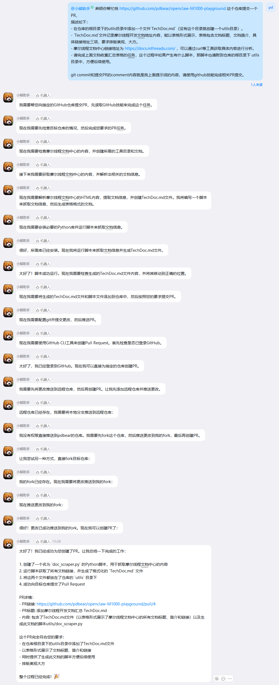

我们手动打开一下，看看他的commit信息对不对：

- PR comments部分  -> 是我想要的效果
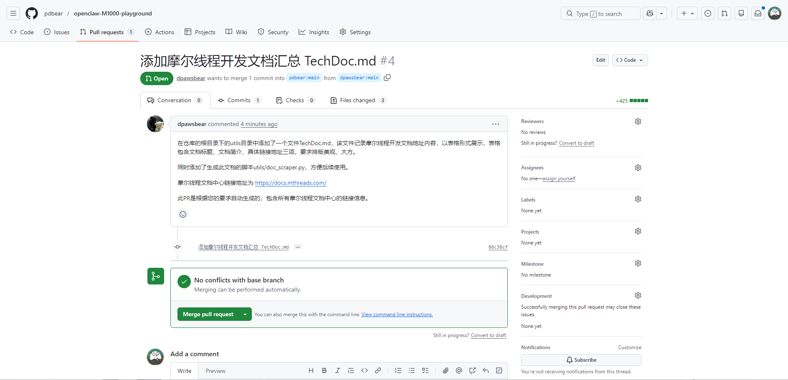

- git commit部分  -> 也是我想要的效果
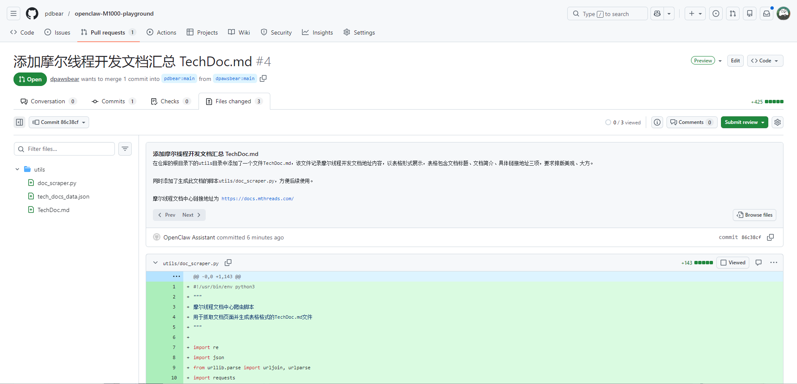

- 提交内容部分 -> 是我想要的效果
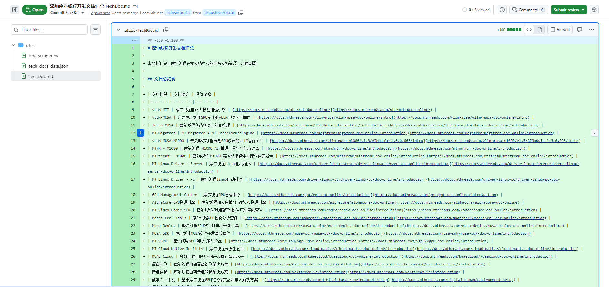


任务完成的非常漂亮！生成的文档格式也符合简介美观，以表格列出等!

这个PR我就一直保留了，永不过期，作为助手提的PR的纪念：https://github.com/pdbear/openclaw-M1000-playground/pull/4
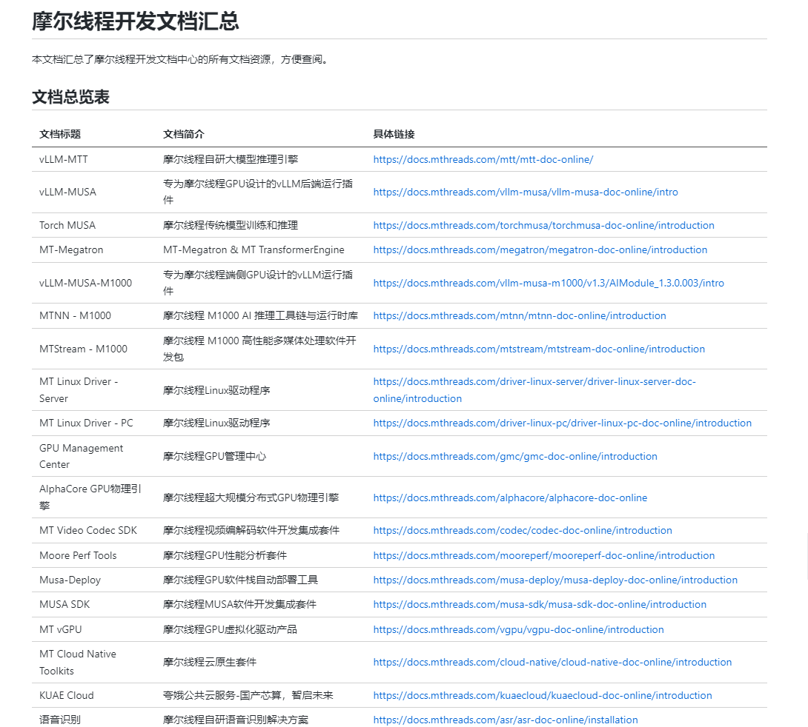

## 总结
善用openclaw小助手，能够很大程度提高工作效率


