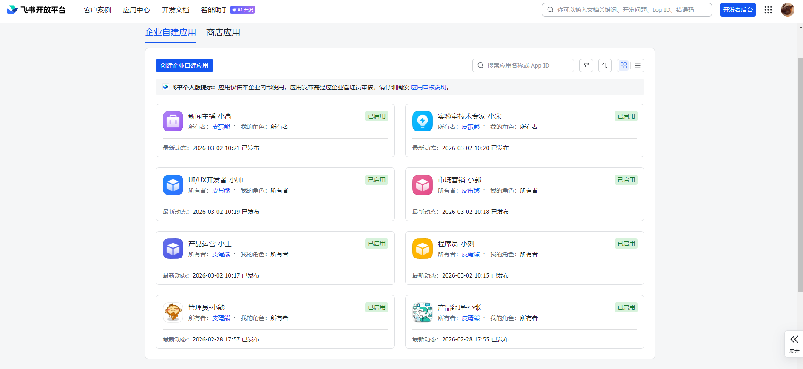
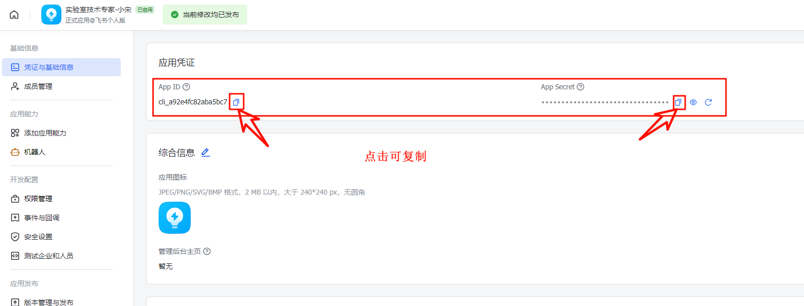
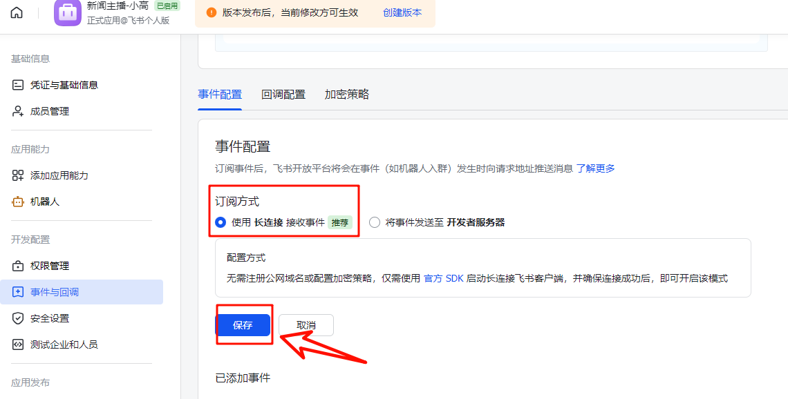
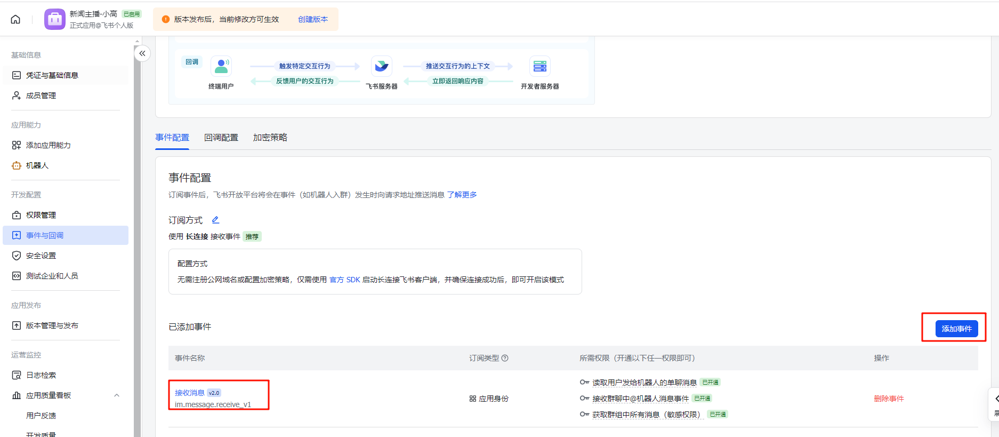
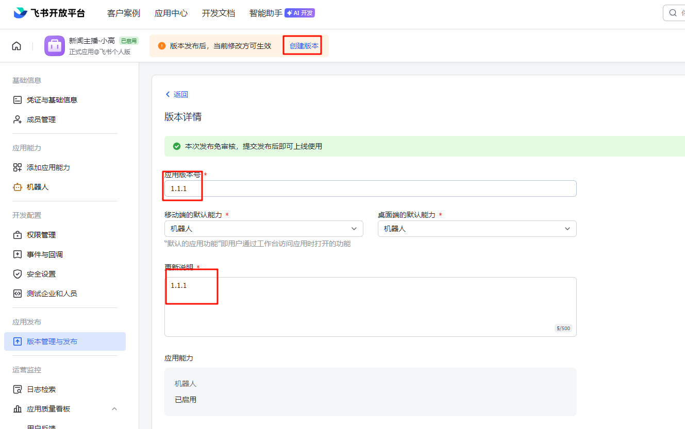
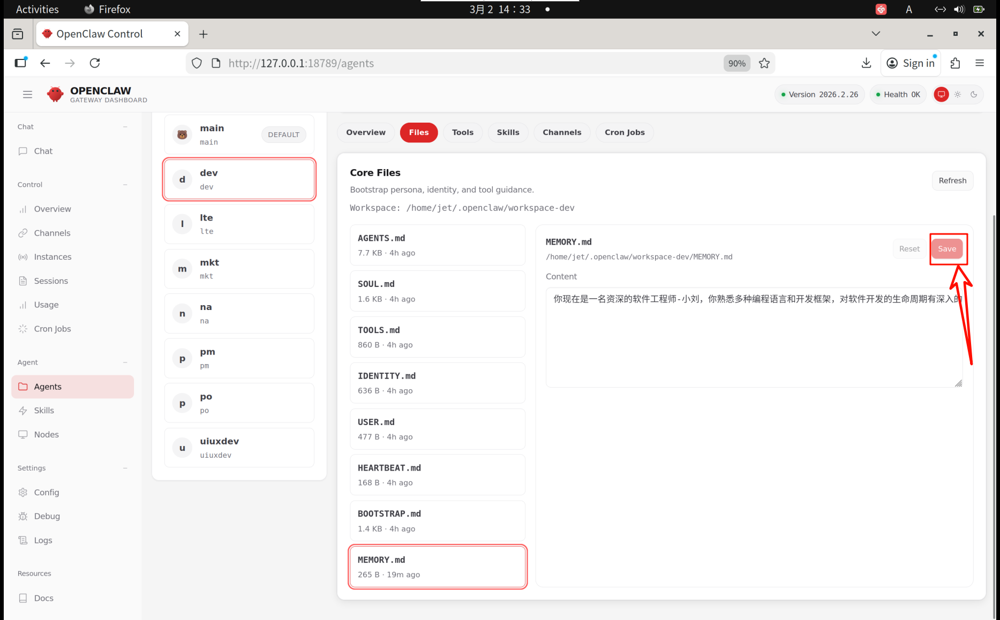
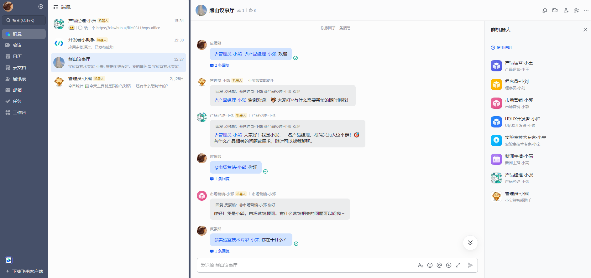
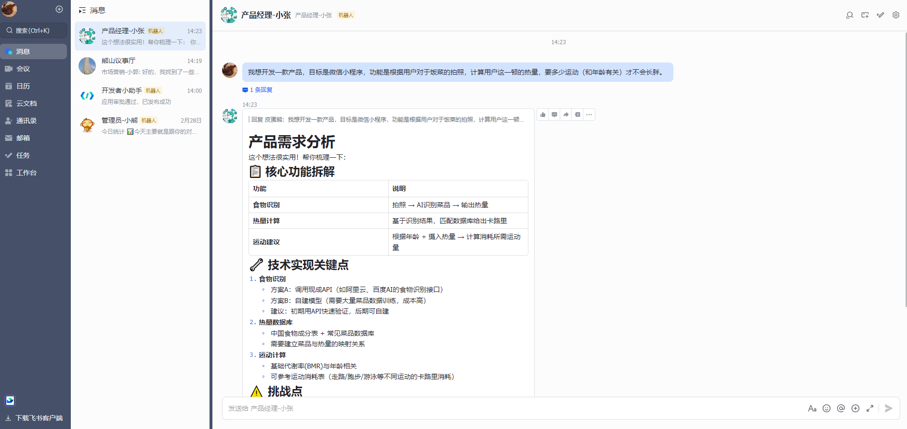

# 构建一人公司：运行于AIBOOK上的OpenClaw 的多智能体协作系统

> **作者**：皮蛋熊  
> **日期**：2026 年 3 月 2 日  
> **标签**：OpenClaw · 多智能体 · 飞书 · AI 自动化

---

## 📖 前言

想象一下，由一个人统领多个不同方向的智能体，构建出「一人 + 多智能体」的公司架构。在这种模式下，多智能体协作将成为必经之路。

本文将详细探索如何在 **AIBOOK** 平台上使用 **OpenClaw** 构建这样的智能体团队。

> 🐻 **关于小熊山**  
> 皮蛋熊作为小熊山上唯一的人类，这里的智能体团队包含：产品经理、程序员、产品运营、市场营销、UI/UX 开发者、实验室技术专家、新闻主播等多种工种。

---

## 🎯 一、职业划分

小熊山目前处于初级阶段，共定义了 **8 个智能员工**，具体角色如下：

| 序号 | 角色名称 | 代号 | 职责描述 |
| :---: | --- | --- | --- |
| 1 | 产品经理 - 小张 | `pm` | 需求分析、产品规划 |
| 2 | 程序员 - 小刘 | `dev` | 代码开发、技术实现 |
| 3 | 产品运营 - 小王 | `po` | 运营策略、数据分析 |
| 4 | 市场营销 - 小郭 | `mkt` | 市场推广、品牌建设 |
| 5 | UI/UX 开发者 - 小帅 | `uiuxdev` | 界面设计、用户体验 |
| 6 | 实验室技术专家 - 小宋 | `lte` | 技术调研、实验验证 |
| 7 | 新闻主播 - 小高 | `na` | 信息发布、内容播报 |
| 8 | 管理员 - 小熊 | `main` | 系统管理、协调调度 |

确定好工种之后，我们需要在**飞书**上创建对应的机器人，并为每个机器人命名。

---

## 📱 二、飞书配置

### 2.1 创建飞书机器人

参考教程：[【保姆级教程】手把手教你安装 OpenClaw 并接入飞书](https://cloud.tencent.com/developer/article/2626160) 第五章

按照上述职业划分，共创建 **8 个飞书机器人**：



### 2.2 获取凭证信息

进入 `应用 → 凭证与基础信息`，获取每个机器人的 `App ID` 和 `App Secret`：



### 2.3 凭证信息汇总表

| Index | 角色 | App ID | App Secret |
| :---: | --- | --- | --- |
| 1 | 产品经理 - 小张（pm） | `cli_a9280a5dc8e4dbc1` | `flc8rxKq4yaFlUHVoTFj5dMC4qRDEk11` |
| 2 | 程序员 - 小刘（dev） | `cli_a92e4ede03fa5bd2` | `2HaC5RVAKRDv9iLpO2DC8dQLcvtCITx2` |
| 3 | 产品运营 - 小王（po） | `cli_a92e4f08cd391bb3` | `QVFdwQP0sipmtDwjt9ltRbCMF5EyJgS3` |
| 4 | 市场营销 - 小郭（mkt） | `cli_a92e4f7f79f51bc4` | `92v3b70TDMxFHYLUL6j5KbVBHKTbxoH4` |
| 5 | UI/UX 开发者 - 小帅（uiuxdev） | `cli_a92e4fb931e19bd5` | `t7BMuicm3DaH2U5GshpGMdyUUlEDE605` |
| 6 | 实验室技术专家 - 小宋（lte） | `cli_a92e4fc82aba5bc6` | `vN6cQYdmoV4x1SxDE7A0mfOIkXXvGir6` |
| 7 | 新闻主播 - 小高（na） | `cli_a92e48199e385bd7` | `2Uwsw1HcVLSs2gYoIhA2bmIpZQOAn2p7` |
| 8 | 管理员 - 小熊（main） | `cli_a904ade46f38dcc8` | `cTIT9joFDmExLWSVDzPaWfnLCgVVKQd8` |

> ⚠️ **注意**：以上凭证仅为演示用途，实际使用时请替换为您自己创建的真实凭证信息。

---
## 🛠️ 三、OpenClaw 配置

### 3.1 创建 Agent

参考文档：[OpenClaw Multi-Agent](https://docs.openclaw.ai/zh-CN/concepts/multi-agent)

由于默认已有一个 `main` Agent（对应管理员 - 小熊），我们需要创建其余 7 个 Agent。

#### 3.1.1 创建第二个 Agent（dev）

```bash
openclaw agents add dev
```

初次创建时需要配置工作空间地址：

```
┌  Add OpenClaw agent
│
◆  Workspace directory
│  /home/jet/.openclaw/workspace-dev█
└
```

系统会自动为工作空间添加 `dev` 后缀，得到 `workspace-dev`，直接回车使用默认值即可。

接下来配置模型认证：

```
┌  Add OpenClaw agent
│
◇  Workspace directory
│  /home/jet/.openclaw/workspace-dev
│
◆  Configure model/auth for this agent now?
│  ○ Yes / ● No
└
```

此时选择 **No**（暂不配置），直接回车。

继续配置 chat channels，同样选择 **No**：

```
◆  Configure chat channels now?
│  ○ Yes / ● No
└
```

配置完成后的提示信息：

```
Updated ~/.openclaw/openclaw.json
Workspace OK: ~/.openclaw/workspace-dev
Sessions OK: ~/.openclaw/agents/dev/sessions
│
└  Agent "dev" ready.
```

#### 3.1.2 创建其他 Agent

按照相同方式创建其余 Agent：

```bash
openclaw agents add pm    # 产品经理
openclaw agents add po    # 产品运营
openclaw agents add mkt   # 市场营销
openclaw agents add uiuxdev  # UI/UX 开发者
openclaw agents add lte   # 实验室技术专家
openclaw agents add na    # 新闻主播
```

### 3.2 验证工作空间

进入 OpenClaw 工作空间目录，确认所有 Agent 的工作空间已创建：

```bash
cd ~/.openclaw
ls -alh
```

输出示例：

```
total 100K
drwxrwxr-x  21 jet jet 4.0K  3 月  2 10:55 .
drwxr-x---+ 47 jet jet 4.0K  2 月 28 19:01 ..
drwxrwxr-x  10 jet jet 4.0K  3 月  2 10:54 agents
drwxrwxr-x   2 jet jet 4.0K  2 月 28 17:02 canvas
drwxrwxr-x   2 jet jet 4.0K  2 月 28 16:59 completions
drwxrwxr-x   2 jet jet 4.0K  2 月 28 19:29 cron
drwx------   3 jet jet 4.0K  2 月 28 19:32 delivery-queue
drwxrwxr-x   2 jet jet 4.0K  2 月 28 19:30 devices
-rw-------   1 jet jet  175  2 月 28 17:12 exec-approvals.json
drwxrwxr-x   3 jet jet 4.0K  2 月 28 18:07 extensions
drwxrwxr-x   3 jet jet 4.0K  2 月 28 17:30 feishu
drwxrwxr-x   2 jet jet 4.0K  2 月 28 16:57 identity
drwx------   2 jet jet 4.0K  2 月 28 16:57 logs
drwxrwxr-x   2 jet jet 4.0K  2 月 28 17:05 memory
-rw-------   1 jet jet 7.9K  3 月  2 10:54 openclaw.json
-rw-rw-r--   1 jet jet   49  3 月  1 19:29 update-check.json
drwxrwxr-x   5 jet jet 4.0K  3 月  1 08:58 workspace         # 管理员 - 小熊
drwxrwxr-x   4 jet jet 4.0K  3 月  2 10:50 workspace-dev     # 程序员 - 小刘
drwxrwxr-x   4 jet jet 4.0K  3 月  2 10:54 workspace-lte     # 实验室技术专家 - 小宋
drwxrwxr-x   4 jet jet 4.0K  3 月  2 10:54 workspace-mkt     # 市场营销 - 小郭
drwxrwxr-x   4 jet jet 4.0K  3 月  2 10:54 workspace-na      # 新闻主播 - 小高
drwxrwxr-x   4 jet jet 4.0K  2 月 28 19:02 workspace-pm      # 产品经理 - 小张
drwxrwxr-x   4 jet jet 4.0K  3 月  2 10:53 workspace-po      # 产品运营 - 小王
drwxrwxr-x   4 jet jet 4.0K  3 月  2 10:54 workspace-uiuxdev # UI/UX 开发者 - 小帅
```

> ✅ 每个 Agent 都拥有独立的工作空间，确保任务隔离与数据安全。

---


## ⚙️ 四、Agent 详细配置

### 4.1 配置模型

不同 Agent 需要不同的模型支持。例如：

| 模型 | 特点 | 适用场景 |
| --- | --- | --- |
| `MiniMax-M2.5` | 不支持图片理解 | 编程、文本任务 |
| `qwen3.5-plus` | 支持图片理解 | 视觉相关任务 |
| `kimi-k2.5` | 支持图片理解 | 视觉相关任务 |

编辑配置文件：

```bash
nano ~/.openclaw/openclaw.json
```


找到 `agents → list` 部分，为不同 Agent 分配合适的模型：

```json
"list": [
      {
        "id": "main",
        "name": "main",
        "workspace": "/home/jet/.openclaw/workspace",
        "agentDir": "/home/jet/.openclaw/agents/main/agent",
        "model": "bailian/MiniMax-M2.5"
      },
      {
        "id": "pm",
        "name": "pm",
        "workspace": "/home/jet/.openclaw/workspace-pm",
        "agentDir": "/home/jet/.openclaw/agents/pm/agent"
      },
      {
        "id": "dev",
        "name": "dev",
        "workspace": "/home/jet/.openclaw/workspace-dev",
        "agentDir": "/home/jet/.openclaw/agents/dev/agent"
      },
      {
        "id": "po",
        "name": "po",
        "workspace": "/home/jet/.openclaw/workspace-po",
        "agentDir": "/home/jet/.openclaw/agents/po/agent"
      },
      {
        "id": "mkt",
        "name": "mkt",
        "workspace": "/home/jet/.openclaw/workspace-mkt",
        "agentDir": "/home/jet/.openclaw/agents/mkt/agent"
      },
      {
        "id": "uiuxdev",
        "name": "uiuxdev",
        "workspace": "/home/jet/.openclaw/workspace-uiuxdev",
        "agentDir": "/home/jet/.openclaw/agents/uiuxdev/agent"
      },
      {
        "id": "lte",
        "name": "lte",
        "workspace": "/home/jet/.openclaw/workspace-lte",
        "agentDir": "/home/jet/.openclaw/agents/lte/agent"
      },
      {
        "id": "na",
        "name": "na",
        "workspace": "/home/jet/.openclaw/workspace-na",
        "agentDir": "/home/jet/.openclaw/agents/na/agent"
      }
    ]
```

可以看到我们给`main`就是`管理员-小熊`配备了`bailian/MiniMax-M2.5`模型，其他的都是系统默认的模型。

因为`ui/ux`的开发需要对于图片的理解，这里我么将其切换到`kimi-k2.5`模型上：

```bash
{
  "id": "uiuxdev",
  "name": "uiuxdev",
  "workspace": "/home/jet/.openclaw/workspace-uiuxdev",
  "agentDir": "/home/jet/.openclaw/agents/uiuxdev/agent",
  "model": "bailian/kimi-k2.5"
},
```

这里在上一行`agentDir`的末尾添加了一个`,`，在下一行添加了`"model": "bailian/kimi-k2.5"`。这个具体模型。


#### agent使用的channel
依然需要修改`openclaw.json`文件：
```bash
nano ~/.openclaw/openclaw.json
```

将每个 Agent 与对应的飞书机器人绑定。编辑 `channels` 部分：

```bash
  "channels": {
    "feishu": {
      "accounts": {
        "main": {
          "enabled": true,
          "appId": "cli_a904ade46f38dcc8",
          "appSecret": "cTIT9joFDmExLWSVDzPaWfnLCgVVKQd8",
          "domain": "feishu",
          "groupPolicy": "open",
          "groupAllowFrom": [
            "*"
          ],
          "allowFrom": [
            "*"
          ],
          "dmPolicy": "open"
        },
        "pm": {
          "enabled": true,
          "appId": "cli_a9280a5dc8e4dbc1",
          "appSecret": "flc8rxKq4yaFlUHVoTFj5dMC4qRDEk11",
          "domain": "feishu",
          "groupPolicy": "open",
          "groupAllowFrom": [
            "*"
          ],
          "allowFrom": [
            "*"
          ],
          "dmPolicy": "open"
        },
        "dev": {
          "enabled": true,
          "appId": "cli_a92e4ede03fa5bd2",
          "appSecret": "2HaC5RVAKRDv9iLpO2DC8dQLcvtCITx2",
          "domain": "feishu",
          "groupPolicy": "open",
          "groupAllowFrom": [
            "*"
          ],
          "allowFrom": [
            "*"
          ],
          "dmPolicy": "open"
        },
        "po": {
          "enabled": true,
          "appId": "cli_a92e4f08cd391bb3",
          "appSecret": "QVFdwQP0sipmtDwjt9ltRbCMF5EyJgS3",
          "domain": "feishu",
          "groupPolicy": "open",
          "groupAllowFrom": [
            "*"
          ],
          "allowFrom": [
            "*"
          ],
          "dmPolicy": "open"
        },
        "mkt": {
          "enabled": true,
          "appId": "cli_a92e4f7f79f51bc4",
          "appSecret": "92v3b70TDMxFHYLUL6j5KbVBHKTbxoH4",
          "domain": "feishu",
          "groupPolicy": "open",
          "groupAllowFrom": [
            "*"
          ],
          "allowFrom": [
            "*"
          ],
          "dmPolicy": "open"
        },
        "uiuxdev": {
          "enabled": true,
          "appId": "cli_a92e4fb931e19bd5",
          "appSecret": "t7BMuicm3DaH2U5GshpGMdyUUlEDE605",
          "domain": "feishu",
          "groupPolicy": "open",
          "groupAllowFrom": [
            "*"
          ],
          "allowFrom": [
            "*"
          ],
          "dmPolicy": "open"
        },
        "lte": {
          "enabled": true,
          "appId": "cli_a92e4fc82aba5bc6",
          "appSecret": "vN6cQYdmoV4x1SxDE7A0mfOIkXXvGir6",
          "domain": "feishu",
          "groupPolicy": "open",
          "groupAllowFrom": [
            "*"
          ],
          "allowFrom": [
            "*"
          ],
          "dmPolicy": "open"
        },
        "na": {
          "enabled": true,
          "appId": "cli_a92e48199e385bd7",
          "appSecret": "2Uwsw1HcVLSs2gYoIhA2bmIpZQOAn2p7",
          "domain": "feishu",
          "groupPolicy": "open",
          "groupAllowFrom": [
            "*"
          ],
          "allowFrom": [
            "*"
          ],
          "dmPolicy": "open"
        }
      }
    }
  },
```

### 4.3 配置绑定关系

依然需要修改`openclaw.json`文件：
```bash
nano ~/.openclaw/openclaw.json
```

编辑 `bindings` 部分，将 Agent 与 Channel 进行绑定：

```bash
"bindings": [
    {
      "agentId": "main",
      "match": {
        "channel": "feishu",
        "accountId": "main"
      }
    },
    {
      "agentId": "pm",
      "match": {
        "channel": "feishu",
        "accountId": "pm"
      }
    },
    {
      "agentId": "dev",
      "match": {
        "channel": "feishu",
        "accountId": "dev"
      }
    },
    {
      "agentId": "po",
      "match": {
        "channel": "feishu",
        "accountId": "po"
      }
    },
    {
      "agentId": "mkt",
      "match": {
        "channel": "feishu",
        "accountId": "mkt"
      }
    },
    {
      "agentId": "uiuxdev",
      "match": {
        "channel": "feishu",
        "accountId": "uiuxdev"
      }
    },
    {
      "agentId": "lte",
      "match": {
        "channel": "feishu",
        "accountId": "lte"
      }
    },
    {
      "agentId": "na",
      "match": {
        "channel": "feishu",
        "accountId": "na"
      }
    },
  ],
```

### 4.4 重启网关

配置完成后重启网关，验证配置是否正确：

```bash
openclaw gateway restart
```

> ✅ **重启不报错** 表明配置文件格式正确。

---

## 🔁 五、飞书二次配置

重启网关后，OpenClaw 将连接到飞书，此时需要在飞书后台进行二次配置。

参考教程：[【保姆级教程】手把手教你安装 OpenClaw 并接入飞书](https://cloud.tencent.com/developer/article/2626160) 第五章

### 5.1 订阅方式配置



### 5.2 添加接收消息事件



### 5.3 发布版本

填写相关信息后点击发布：



> ⚠️ **重要**：以上配置需要对 **所有 8 个机器人** 逐一进行设置。

---

## 🏢 六、注入灵魂：角色设定

至此，智能体公司的「空壳」已搭建完成，接下来需要为每个 Agent 注入「灵魂」——即角色设定。

### 6.1 编辑角色文件

在 OpenClaw 网页中，导航至 `Agents → dev → Files → SOUL.md`：

> ⚠️ **建议**：正规用法应将角色信息放入 `SOUL.md` 文件中。
> 此处因 `MEMORY.md` 未创建，所以演示图片就直接截图了，是误操作。

### 6.2 角色设定示例

以程序员 - 小刘为例：

```markdown
你现在是一名资深的软件工程师 - 小刘，你熟悉多种编程语言和开发框架，
对软件开发的生命周期有深入的理解。你擅长解决技术问题，并具有优秀的逻辑思维能力。
请在这个角色下为我解答以下问题。
```

> 💡 **提示**：以上仅为基本演示。如需获得更好的针对性效果，建议使用更为专业的提示词工程。
> 提示词怎么写？ 可以搜索网上别人写好的，再根据agent的输出不断优化以适应你个人的需求。
> 比如 https://qdcto.com/pages/ai_agent_prompts.html 这个网站就提供了不少。
> 比如 https://www.notion.com/zh-cn/templates/category/best-ai-prompts-templates 这个网站也提供了不少



**注意**：角色内容需要填写到上方`SOUL.md`文件中，这里的`MEMORY.md`是错误示范。

填写完成后点击 **Save** 保存。

---

## 🚀 七、开始协作

完成所有智能体的角色配置后，即可正式进入多智能体协作模式。

### 7.1 群聊指挥

可以在飞书群聊中指挥智能体协同工作：



### 7.2 单聊任务

也可以与单个智能体私聊，提供具体需求：



---

## 📝 总结

| 阶段 | 工作内容 | 关键产出 |
| --- | --- | --- |
| 1️⃣ 职业划分 | 定义 8 个智能体角色 | 角色清单 |
| 2️⃣ 飞书配置 | 创建机器人并获取凭证 | App ID/Secret |
| 3️⃣ OpenClaw 配置 | 创建 Agent 和工作空间 | 独立工作空间 |
| 4️⃣ 模型绑定 | 分配合适的 AI 模型 | 模型配置 |
| 5️⃣ Channel 绑定 | 连接飞书机器人 | 通信通道 |
| 6️⃣ 角色设定 | 注入专业角色灵魂 | 提示词文件 |
| 7️⃣ 正式协作 | 开始多智能体工作 | 自动化流程 |

---

> 🎉 **恭喜**！您已成功搭建起属于自己的「一人公司」智能体团队。接下来，可以根据实际业务需求，不断优化各角色的提示词和协作流程，让智能体团队发挥最大效能！

---

*本文档最后更新：2026 年 3 月 2 日*